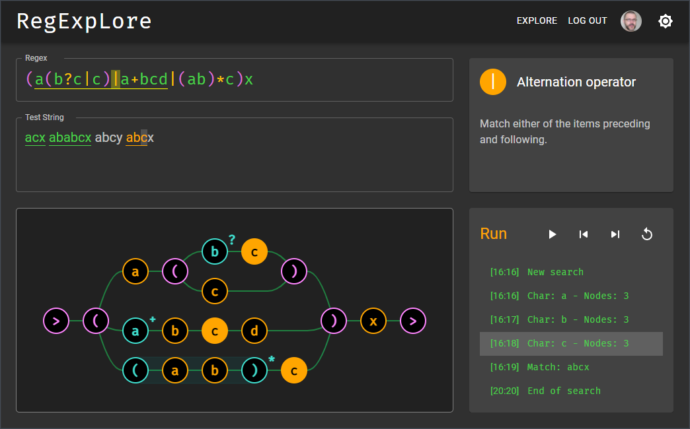
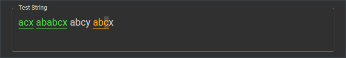

# RegExpLore

- [About](#about)
- [Features](#features)
- [Installation](#installation)

---

## About

**RegExpLore** is a regular expression visualizer and debugger built with [React](https://reactjs.org/), [Express](https://expressjs.com/) and [Material UI](https://mui.com/). The App includes syntax highlighting, a graph visualization, and a step-by-step execution mode, all of which are designed to help users learn about regular expressions and work with them.

---

## Features

The App includes the following features:

- Syntax highlighting helps parsing the regex.
- Operand ranges are shown on hover.

- Additional information on each token is shown on hover in a separate box.

- Syntax errors are highlighted in the regex.

- Additional information on the errors is shown in a separate box.
- An auto-fix function is available to clean up the regex.

- A graph based on the nondeterministic finite automaton (NFA) for the regex is built and updated as the user types the regex.

- The regex can be executed step-by-step: forward, backward or in auto-play.
- The nodes in the graph visualize the state of the NFA at each step.
- A log keeps tracks of the results.

- Syntax highlighting of the test string also helps track the progression of the search.

---

## Installation

- (Optional) Clone and start the [server](https://github.com/milesAwayAlex/regexplore-server) - `git clone https://github.com/milesAwayAlex/regexplore-server.git`
- Clone the repository - `git clone https://github.com/ycandau/regexplore.git`
- Open the app directory - `cd regexplore`
- Install the dependencies - `yarn install`
- Start the app - `yarn start`
