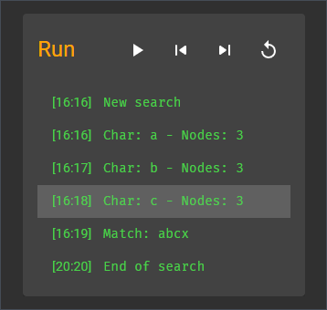

# RegExpLore

- [About](#about)
- [Features](#features)
- [Installation](#installation)
- [Links](#links)
- [Dependencies](#dependencies)
- [Development dependencies](#development-dependencies)

---

## About

**RegExpLore** is a regular expression visualizer and debugger built with [React](https://reactjs.org/), [Express](https://expressjs.com/) and [Material UI](https://mui.com/). The app is designed to help users better understand how regular expressions operate, by providing various types of information as they type a regex or interact with it. Features include:

- syntax highlighting for both the regex and the test string,
- specific information on each token,
- warnings for syntax errors,
- an auto-fix function,
- a graph visualization, and
- a step-by-step execution mode for debugging.

RegExpLore leverages a custom regular expression engine to compile the regex and generate extra information about it. All the React components including the syntax highlighted editor and the graph visualization are coded from scratch.


---

## Features

The app includes the following features:

- Syntax highlighting helps parsing the regex.
- Operand ranges are shown on hover.


- Additional information about each token is shown on hover in a separate box.


- Syntax errors are highlighted in the regex.


- Additional information on the errors is shown in a separate box.
- An auto-fix function is available to clean up the regex.


- The app displays a graph based on the nondeterministic finite automaton for the regex.
- Quantifiers are indicated through colors and tags to keep the graph simpler and more readable.
- Technically the nodes of this graph are the edges of the NFA and vice-versa.
- This transformation also aims to improve the readability of the graph.


- The regex can be executed step-by-step: forward, backward or in auto-play.
- The nodes in the graph visualize the state of the NFA at each step.
- A log keeps tracks of the results.



- Syntax highlighting of the test string helps track the progression of the search.


---

## Installation

Clone the repository with [git](https://git-scm.com/):

```shell
git clone git@github.com:ycandau/regexplore.git
```

Install all the dependencies with [yarn](https://classic.yarnpkg.com/en/):

```shell
yarn install
```

The app also requires the [RegExpLore Server](https://github.com/milesAwayAlex/regexplore-server) to be installed separately.

For better user experience, we recommend the production build. First generate a new build:

```shell
yarn build
```

Then run it:

```shell
npx serve -s build
```

---

## Links

- [The shunting-yard algorithm](https://en.wikipedia.org/wiki/Shunting-yard_algorithm): Convert the regex into Reverse Polish Notation.
- [Ken Thompson's algorithm](https://swtch.com/~rsc/regexp/regexp1.html): Build a non-deterministic finite automata to run the regex.

---

## Dependencies

- [React](https://reactjs.org/)
- [Material UI](https://mui.com/)

---

## Development dependencies

- [Storybook](https://storybook.js.org/)
- [Testing library](https://testing-library.com/)
